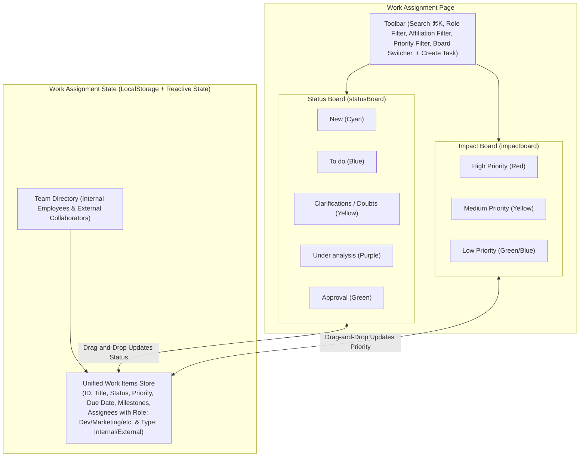

# Implementation Plan: Work Assignment & Priority Check (ImpactBoard & StatusBoard)

Build a modern, high-fidelity **Work Assignment & Priority Management Page** with drag-and-drop capability using the installed Shadcn Kanban Board component (`src/components/kanban.tsx`), featuring two synchronized Kanban boards:
1. **Status Board (`statusBoard`)**: Columns for `New`, `To do`, `Clarifications / Doubts`, `Under analysis`, and `Approval`.
2. **Impact Board (`impactboard`)**: Columns for `High Priority`, `Medium Priority`, and `Low Priority` to check and adjust work impact/urgency.
3. **Role & Affiliation Assignment**:
   - Functional roles: **Developer**, **Marketing**, **Design**, **Product**, **QA**, **Operations**.
   - Affiliation type: **Internal** (team member) vs **External** (contractor/vendor/client).
   - Configured during task/assignment creation, displayed on cards with dedicated badges/tooltips, and available in filters.

---

## User Review Required

> [!IMPORTANT]
> **User Roles & Affiliation Setup**:
> - **Functional Roles**: Developer, Marketing, Design, Product, QA, Operations.
> - **User Type / Affiliation**: `Internal` vs `External`.
> - **Task Assignment**: When creating or editing a task, you can assign team members with their role and internal/external status. You can also quickly add/create a new collaborator inline (Name, Email, Role, Affiliation).
> - **Card Presentation**: The cards display the assignees with visual indicators (e.g. tag `Marketing · External`, `Dev · Internal`, and avatar tooltips).
> - **Filtering**: Filter tasks by Functional Role (e.g. "Only Developers", "Only Marketing") and by Affiliation ("Internal only", "External only").

> [!NOTE]
> **Board Presentation Modes**:
> The board switcher allows you to toggle between:
> 1. **Status Board** (5 stages: New ➔ To do ➔ Clarifications/Doubts ➔ Under analysis ➔ Approval)
> 2. **Impact Board** (3 priority levels: High ➔ Medium ➔ Low)
> 3. **Dual View / Matrix Overview** (Compare status vs priority side-by-side)
>
> Moving a card on either board updates both its status and priority in the shared reactive store.

---

## Architecture & Data Flow



---

## Proposed Changes

Grouped by component and dependency order:

### 1. Types & Mock Data

#### [NEW] [work.ts](file:///Users/abc/Desktop/Byte-Bandits/Projects/Dashboard-full-project/dashBoard/src/types/work.ts)
- Define TypeScript types:
  - `Priority`: `'high' | 'medium' | 'low'`
  - `WorkStatus`: `'new' | 'todo' | 'clarifications' | 'under_analysis' | 'approval'`
  - `UserRole`: `'Developer' | 'Marketing' | 'Design' | 'Product' | 'QA' | 'Operations'`
  - `UserAffiliation`: `'internal' | 'external'`
  - `Assignee`:
    ```ts
    export interface Assignee {
      id: string;
      name: string;
      avatar?: string;
      role: UserRole;
      affiliation: UserAffiliation;
      email?: string;
    }
    ```
  - `Milestone`: `{ completed: number; total: number }`
  - `WorkItem`:
    ```ts
    export interface WorkItem {
      id: string;
      title: string;
      description: string;
      priority: Priority;
      status: WorkStatus;
      dueDate: string;
      assignees: Assignee[];
      milestone: Milestone;
      attachmentsCount: number;
      commentsCount: number;
      createdAt: string;
    }
    ```

#### [NEW] [mockWorks.ts](file:///Users/abc/Desktop/Byte-Bandits/Projects/Dashboard-full-project/dashBoard/src/data/mockWorks.ts)
- Pre-configured team directory with internal and external collaborators:
  - Alex Rivera (Developer, Internal)
  - Priya Sharma (Developer, Internal)
  - Marcus Vance (Marketing, External - Agency Partner)
  - Elena Rostova (Design, Internal)
  - David Chen (Product, Internal)
  - Liam O'Connor (QA, External - QA Vendor)
  - Sophie Martin (Marketing, Internal)
- Sample works matching screenshot cards with appropriate assignments:
  - "Competitor Research Analysis" (Marketing · Internal & External, Medium priority, To do)
  - "Mobile Dashboard Development" (Developer · Internal, High priority, Under analysis)
  - "Design System Update" (Design · Internal, Medium priority, Clarifications/doubts)
  - "Payment Gateway Integration" (Developer · Internal & QA · External, Low priority, Approval)
  - "Security Compliance Audit" (Developer & QA · External, High priority, Under analysis)
  - "User Onboarding Experience" (Product & Marketing · Internal, Low priority, To do)
  - "API Documentation" (Developer · Internal, Low priority, Clarifications/doubts)
  - "Authentication Module" (Developer · Internal, High priority, Approval)

---

### 2. Styling & Import Configuration

#### [MODIFY] [src/App.css](file:///Users/abc/Desktop/Byte-Bandits/Projects/Dashboard-full-project/dashBoard/src/App.css)
- Ensure the Tailwind CSS v4 `@theme inline` definitions correctly map `--color-kanban-board-circle-primary: var(--primary);` alongside the colors provided by the user:
  - `yellow`, `violet`, `red`, `purple`, `pink`, `indigo`, `green`, `gray`, `cyan`, `blue`.
- Add badges styling for:
  - Role tags (`Developer` in indigo/blue, `Marketing` in purple/pink, `Design` in amber, `QA` in teal, etc.)
  - Affiliation tags (`Internal` vs `External` with pill badge)

#### [MODIFY] [src/components/kanban.tsx](file:///Users/abc/Desktop/Byte-Bandits/Projects/Dashboard-full-project/dashBoard/src/components/kanban.tsx)
- Replace `~/components/...` and `~/lib/utils` imports with `@/components/...` and `@/lib/utils` to fix compiler errors.

#### [MODIFY] [src/components/ui/textarea.tsx](file:///Users/abc/Desktop/Byte-Bandits/Projects/Dashboard-full-project/dashBoard/src/components/ui/textarea.tsx)
- Replace `~/lib/utils` with `@/lib/utils`.

#### [MODIFY] [tsconfig.app.json](file:///Users/abc/Desktop/Byte-Bandits/Projects/Dashboard-full-project/dashBoard/tsconfig.app.json) and [vite.config.ts](file:///Users/abc/Desktop/Byte-Bandits/Projects/Dashboard-full-project/dashBoard/vite.config.ts)
- Register `"~/*": ["src/*"]` alias for complete compatibility.

#### [MODIFY] [src/api/axios.ts](file:///Users/abc/Desktop/Byte-Bandits/Projects/Dashboard-full-project/dashBoard/src/api/axios.ts)
- Fix type check on `response.headers["content-type"]` (`typeof contentType === "string" && contentType.includes("text/html")`) to avoid compilation failure.

---

### 3. Work Assignment Components & Screen

#### [NEW] [WorkCard.tsx](file:///Users/abc/Desktop/Byte-Bandits/Projects/Dashboard-full-project/dashBoard/src/screens/work/components/WorkCard.tsx)
- Custom card rendered inside `KanbanBoardCard`:
  - **Header**: Due date (`⏱ Due: 11 Dec, 2026`) + `...` options menu (Edit, Delete, Move)
  - **Title**: Clean bold title
  - **Description**: Muted 2-line truncated text
  - **Milestone Progress**: Milestone label (`Milestone 2/8`) with segmented visual progress blocks in green
  - **Assigned For**:
    - "Assigned for" text label
    - Stacked assignee avatars with tooltip displaying Name, Role (`Developer`, `Marketing`), and Affiliation (`Internal` vs `External`)
    - Role badges showing primary department and affiliation badge (e.g. `Marketing · External`, `Developer · Internal`)
  - **Footer**:
    - Priority badge (Flag icon + `High` in soft red, `Medium` in soft amber, `Low` in soft blue)
    - Status badge (when rendered in Impact Board)
    - Attachment indicator (`📎 count`)
    - Comment indicator (`💬 count`)

#### [NEW] [WorkModal.tsx](file:///Users/abc/Desktop/Byte-Bandits/Projects/Dashboard-full-project/dashBoard/src/screens/work/components/WorkModal.tsx)
- Modal dialog for **Create Task** and **Edit Task**:
  - Title & description inputs
  - Priority dropdown: `High`, `Medium`, `Low`
  - Status dropdown: `New`, `To do`, `Clarifications / doubts`, `Under analysis`, `Approval`
  - Due date picker / input
  - Milestone subtask count (completed / total)
  - **Assignee Selection & Collaborator Creation**:
    - Multi-select assignees from existing pool, displaying their Role and Affiliation.
    - Inline form to add a new collaborator: Name, Functional Role (`Developer`, `Marketing`, `Design`, `Product`, `QA`, `Operations`), and Affiliation (`Internal` vs `External`).

#### [NEW] [WorkAssignment.tsx](file:///Users/abc/Desktop/Byte-Bandits/Projects/Dashboard-full-project/dashBoard/src/screens/work/WorkAssignment.tsx)
- The main page component:
  - Uses `useJsLoaded()` to safely mount the drag-and-drop provider.
  - State management for tasks with `localStorage` persistence.
  - **Top Page Header**:
    - Project title ("Product Launch 2026" / "Work Assignment & Priority Check")
    - Subtitle ("Monitor all of your task here.")
    - Team member avatars stack + `+ Invite` button
  - **Controls Bar**:
    - Tabs: `[Kanban View]`, `[List View]`, `[Calendar View]`
    - Board Switcher: Toggle between `📋 Status Board`, `⚡ Impact Board (Priority Check)`, and `🔲 Dual View`
    - Search Bar: Live text search with `⌘K` shortcut
    - **Filter Bar**:
      - Priority Filter (`All`, `High`, `Medium`, `Low`)
      - Role Filter (`All`, `Developer`, `Marketing`, `Design`, `Product`, `QA`, `Operations`)
      - Affiliation Filter (`All`, `Internal`, `External`)
    - `+ Create Task` button
  - **Status Board View (`statusBoard`)**:
    - 5 columns (`New`, `To do`, `Clarifications / doubts`, `Under analysis`, `Approval`)
    - Drag cards between status columns to update status.
    - Each column displays the matching circle color (`--color-kanban-board-circle-...`), title, item count badge, and a `+` button to add tasks directly into that status.
  - **Impact Board View (`impactboard`)**:
    - 3 columns (`High Priority`, `Medium Priority`, `Low Priority`)
    - Drag cards between priority columns to adjust priority ranking.
    - Uses colors: `red` for High, `yellow` for Medium, `green`/`blue` for Low.
  - **List View & Calendar View**:
    - Tabbed alternates for tabular overview and calendar due dates.

---

### 4. Routing & Navigation

#### [MODIFY] [src/App.tsx](file:///Users/abc/Desktop/Byte-Bandits/Projects/Dashboard-full-project/dashBoard/src/App.tsx)
- Register route `/work-assignment` accessible to `['SUPER_ADMIN', 'ADMIN', 'USER']`.

#### [MODIFY] [src/lib/sidebar.ts](file:///Users/abc/Desktop/Byte-Bandits/Projects/Dashboard-full-project/dashBoard/src/lib/sidebar.ts)
- Add "Work Assignment" (icon: `Kanban` or `CheckSquare`) under `navMain` in the sidebar navigation.

---

## Verification Plan

### Automated Tests & Type Checking
1. Run `npm run build` to confirm TypeScript compilation passes without errors (`tsc -b && vite build`).
2. Run `npm run lint` to confirm code style and linting standards.

### Browser / Manual Verification
1. Navigate to `http://localhost:5173/work-assignment`.
2. Verify visual appearance against the reference mockup:
   - Header with title, subtitle, avatars, and Invite button.
   - Tabs, search input, filter bar (Role, Affiliation, Priority), Create Task button.
   - Kanban columns with colored circle indicators, badges, and card counts.
3. Test Drag and Drop:
   - On **Status Board**: drag a task from "To do" to "Clarifications / Doubts" or "Approval". Verify status is updated.
   - Switch to **Impact Board**: drag a task from "Medium" to "High". Verify priority is updated.
   - Switch back to Status Board: verify that the task's priority badge now displays "High".
4. Test Roles & Affiliation:
   - Click "+ Create Task", assign to a Developer (Internal) or Marketing (External), or add a new collaborator.
   - Verify card displays role tag and affiliation indicator.
   - Test filtering by Role ("Developer", "Marketing") and Affiliation ("Internal", "External").
5. Test responsive layout and drag feedback.
